# Travail par Maika Veilleux
## Attaque (exploit)
Voici les étapes détaillées pour pouvoir modifier le courriel / téléphone sur la page demandée:
1. Vérifier si d'autres ports sont ouverts sur le serveur avec nmap.
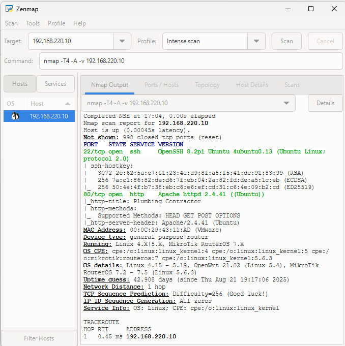  
2. Se connecter par ssh (le port 22 est ouvert) avec l'adresse IP du serveur.
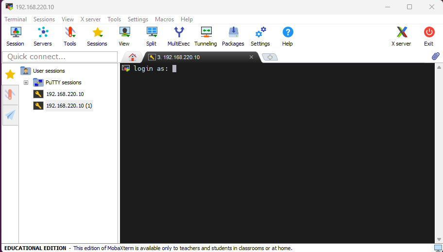  
3. Hacker par force brute avec les informations qu'on a sur bob pour trouver le nom d'utilisateur et le mot de passe. (bob, Sophie2014!)
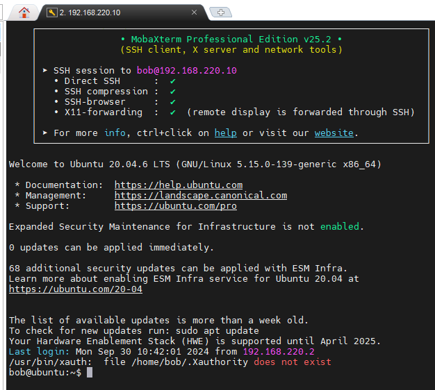  
4. Ouvrir le fichier contact.html qui se trouve dans le répertoire /var/www/html dans un éditeur de texte avec la commande "nano /var/www/html/contact.html". Les permissions du fichier sont à 777 donc Bob a les droits d'écriture.
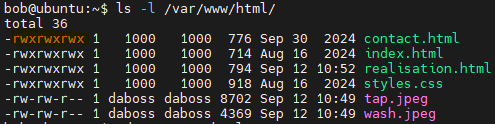  
5. Changer le numéro de téléphone et le courriel dans les balises corrrespondantes et enregistrer les modifications.
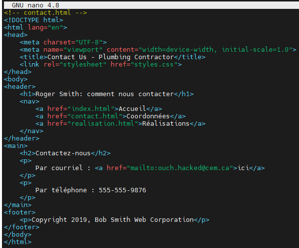  
6. Ouvrir le fichier realisation.html qui se trouve dans le répertoire /var/www/html dans un éditeur de texte avec la commande "nano /var/www/html/realisation.html". Supprimer les balises d'image et enregistrer les modifications.
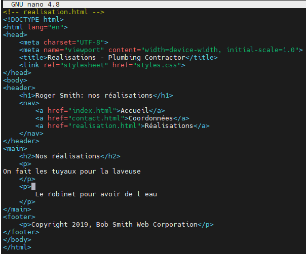  
En rechargeant la page, on constate que le numéro de téléphone a été modifié, les images supprimées et le courriel changé :  
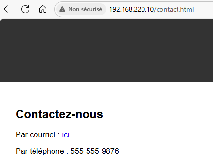  
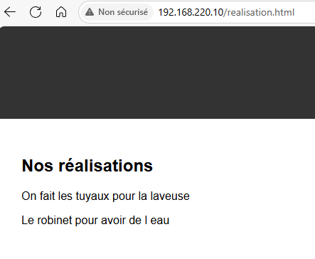
## Correctif 1
mdp: exploit2fix
Pour briser l'étape 2 de l'exploit, on pourrait configurer un pare-feu local pour limiter l'accès au port 22 uniquement aux adresses IP de confiance et bloquer les autres tentatives de connexions :
1. Activer le pare-feu avec la commande "sudo ufw enable"
2. Fermer le port ssh (22) avec la commande "sudo ufw deny 22" (il n'est pas mentionné si un admin a besoin du service SSH pour administrer le serveur à distance donc on ferme le port complètement).  
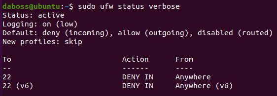  
L'accès au port 22 est maintenant bloqué :  
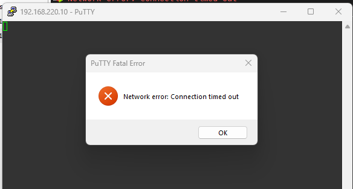  
Le port 22 n'apparaît plus comme étant ouvert sur nmap :  
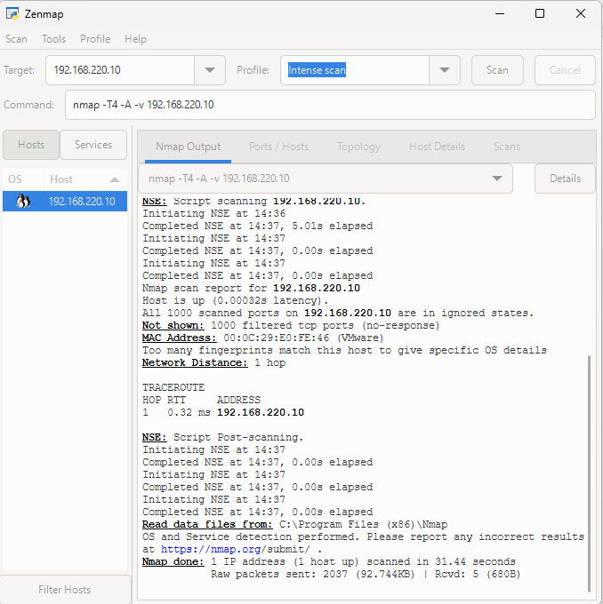  
Copie d'écran du site toujours fonctionnel :
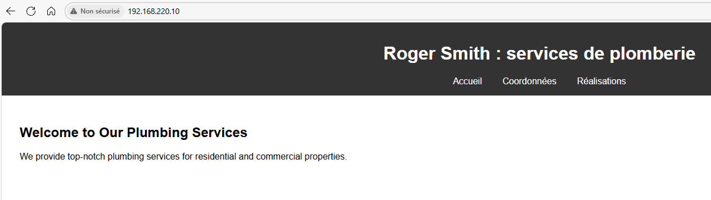
## Correctif 2
Pour briser l'étape 4 de l'exploit, on pourrait utiliser le principe du plus bas privilège en limitant les permissions de l'utilisateur bob. 
1. On crée un groupe qui aura les droits d'écriture et on y ajoute daboss avec les commandes "sudo groupadd webdevs" et "sudo usermod -a -G webdevs daboss".  
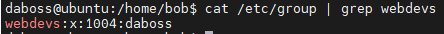  
2. Désigner www-data comme propriétaire du site et webdevs comme groupe propriétaire avec la commande "sudo chown www-data:webdevs -R /var/www/html/*". Mettre les permissions à 460 pour que www-data puisse lire le contenu et que daboss faisant partie du groupe webdevs ai les droits en lecture et écriture avec la commande "sudo chmod -R 460 /var/www/html/*".  
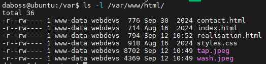  
Puisque bob n'est pas propriétaire et ne fait pas parti du groupe propriétaire il n'aura plus les permissions d'écriture et ne sera plus en mesure de modifier le contenu des fichiers dans /var/www/html/.  
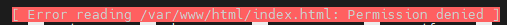  
Copie d'écran du site toujours fonctionnel :
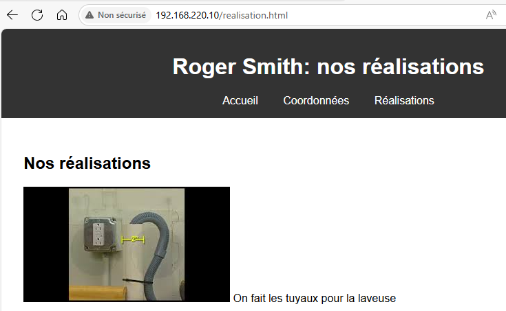

## Correctif 3
Pour briser l'étape 3, on pourrait exiger que les utilisateurs créent un mot de passe plus long ou plus complexe. 
1. Pour exiger un mot de passe plus long, ouvrir le fichier common-password qui se trouve dans le répertoire /etc/pam.d dans un éditeur de texte avec la commande "sudo nano /etc/pam.d/common-password"
2. Ajouter le paramètre de complexité "minlen" avec une valeur de 16 pour mettre le nombre minimal de caractère d'un mot de passe à 16.
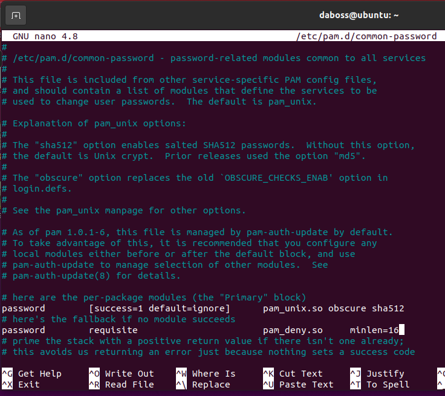  
3. Forcer l'utilisateur bob à changer son mot de passe,
Ensuite, pour s'assurer que Bob utilse un mot de passe plus complexe, il faudra faire de la sensibilisation.
